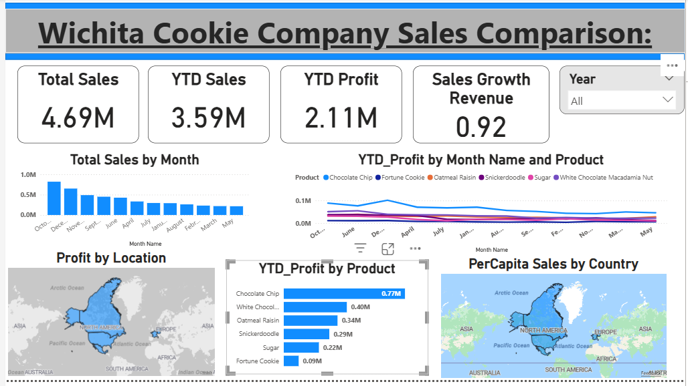

# Wichita Cookie Company — Sales Performance Dashboard

Interactive Power BI dashboard analyzing cookie sales performance across products, locations, and time periods for the Wichita Cookie Company.

---

## Dashboard Preview

---

## What This Dashboard Shows

- **Total Sales:** \.69M across all regions and products
- **YTD Sales:** \.59M | **YTD Profit:** \.11M
- **Sales Growth Revenue:** 0.92 month-over-month
- Product-level profit comparison across 6 cookie types
- Geographic profit distribution mapped by country
- Per-capita sales comparison across countries
- Monthly sales trend and product profit over time

---

## Visuals Used

| Visual | Purpose |
|---|---|
| KPI Cards (4) | Total Sales, YTD Sales, YTD Profit, Sales Growth Revenue |
| Column Chart | Total Sales by Month |
| Line Chart | YTD Profit by Month and Product |
| Bar Chart | YTD Profit by Product |
| Map | Profit by Location (country-level) |
| Map | Per-Capita Sales by Country |
| Year Slicer | Filter all visuals by year |

---

## DAX Measures

- YTD Sales — TOTALYTD on sales amount
- YTD Profit — TOTALYTD on profit
- Sales Growth Revenue — current month vs previous month sales ratio

---

## Data Tables

| Table | Description |
|---|---|
| Wichita Cookie Co Sales | Transaction-level sales records |
| Cookie Cost and Revenue | Cost and revenue per product |
| Products | Product catalog with cookie types |
| Countries | Country population for per-capita analysis |

---

## Tools

Power BI Desktop | DAX | Excel (source data)

---

*BSAN-875: Business Intelligence | Spring 2025 | Wichita State University*
